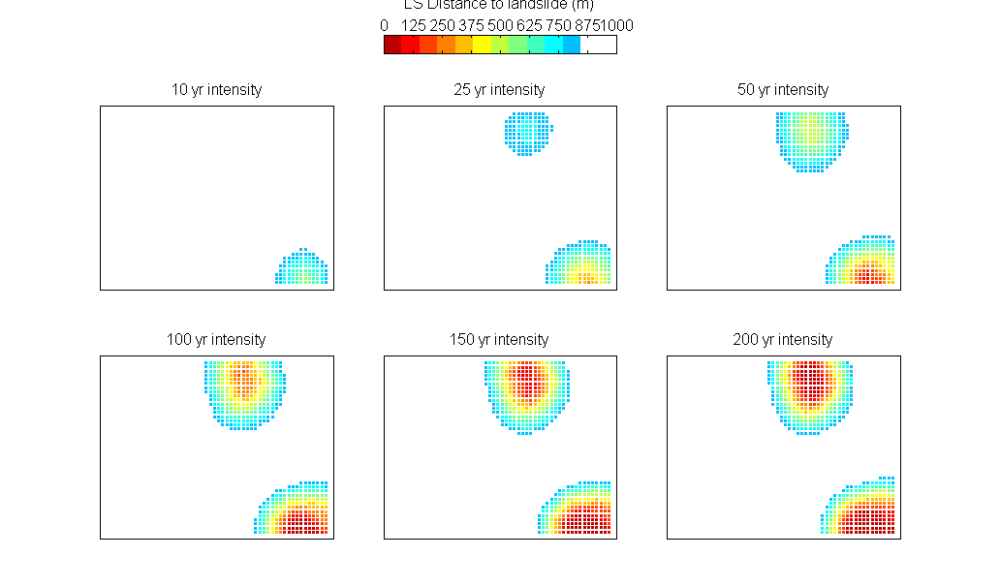

### Welcome to the *climada additional module*  **flood** 

The flood module encompasses the hazard flood and landslides, that are triggered through heavy precipitation events. For now, we are still working on the flood module. But the good news is, that the landslide part is ready to use.

Use the all-in-one function **climada_ls_hazard_set**

 
**Example**

We create a landslide hazard set for [Las Cañas](https://www.google.ch/maps/place/Ilopango,+El+Salvador) neighborhood in the city San Salvador, Central America. The edge coordinates of Las Cañas neighborhood are [-89.145 -89.1 13.692 13.727].
Type **[hazard, centroids, fig] = climada_ls_hazard_set([-89.145 -89.1 13.692 13.727]);** into the command line to create the hazard set.

 
**Get started**

* Get started reading the [landslides manual](/docs/climada_module_landslides.pdf) and the [climada manual](../../../climada/blob/master/docs/climada_manual.pdf).
* Download the climada modules, i.e. [climada core](https://github.com/davidnbresch/climada),  [climada advanced](https://github.com/davidnbresch/climada_advanced) and [flood](https://github.com/davidnbresch/climada_module_flood) into the required folder structure (see figure below).

 
 
 
**Maps for Las Cañas, a neighborhood in San Salvador, Central America**

